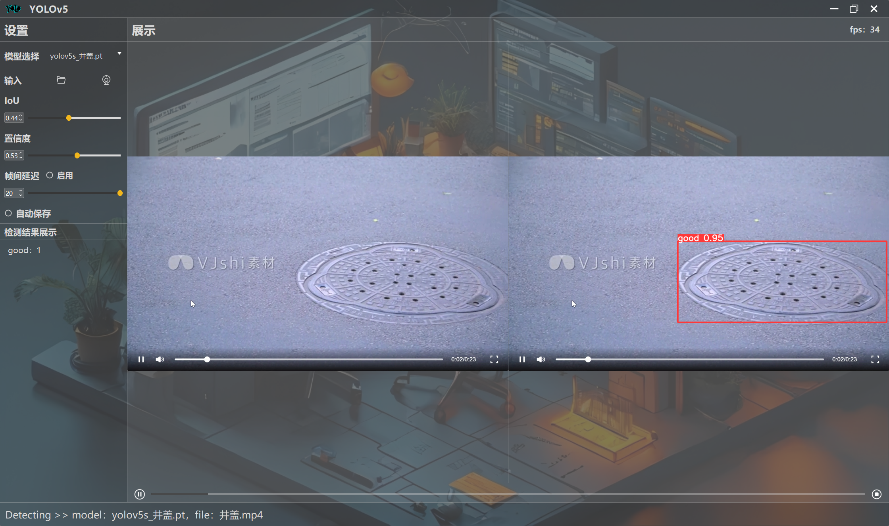

## 使用演示

### 环境配置

**使用conda创建虚拟环境**

打开Anaconda Prompt

```bash
conda create -n yolov5 python=3.8
```


打开项目目录，**选择创建的虚拟环境，在项目目录下进行环境配置**

```bash
pip install -r requirements.txt
```


**注意：该torch版本为torch==1.8.1+cu102，支持GPU，如果CPU运行速度较慢，需要使用GPU的话，需要有英伟达显卡，并且配置CUDA（网上有教程），最低版本10.2。**


下载完之后，需要等待IDE加载完环境（可能需要几分钟时间）


### 运行使用

找到main.py，点击运行即可打开界面


界面如下


### 模型选择（模型支持随时切换）

model选项：模型分为 井盖状态检测  和  常用物品检测（COCO数据集中包含的）

选择模型，精度递增、速度递减依次为 **s,m,l,x** ，对GPU性能的需求也递增，**通常使用s或者m** ，不建议使用l或者x（如果你的电脑性能不够，很可能出现卡顿）


### 参数调节

左侧栏还支持参数的调节，通常不需要使用，如果你对此感兴趣，可以尝试去了解含义和修改


### 图片和视频检测

我以速度最快的yolov5s为例，点击input中的文件夹图标，可以上传图片或者视频，进行检测（images文件夹下有测试图片）


上传后，点击开始后检测


视频也是同理




### 调用摄像头检测

除此之外，还可以调用摄像头，进行实时检测

点击**input行的第二个摄像头图标** ，开始调用摄像头，选择要调用的摄像头（通常就是0），摄像头一般会亮一下，这说明调用成功


我们利用前置摄像头检测常用物品，此时可以切换模型为 yolov5m_COCO.pt

点击左下角图标开始检测，实时检测效果如图


